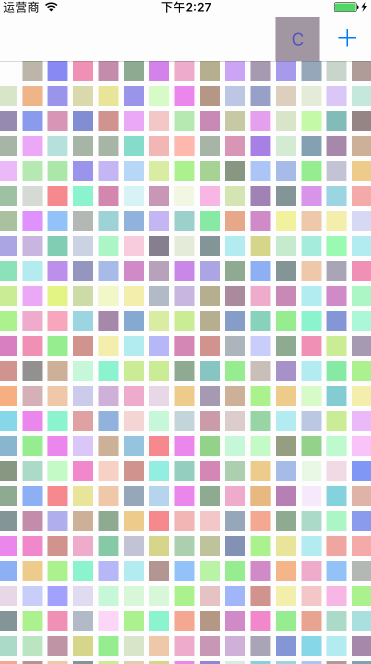

# iOS 仿QQ组件PopoverView

先上地址: [XLPopoverView](https://github.com/ScriptStorage/XLPopoverView)

用法:

```
    XLPopoverView *pop = [[XLPopoverView alloc] init];
    pop.delegate = self;
    pop.attachmentView = sender;
    pop.dataArray = array;
    [pop show];
```

> `dataArray`必须为存有`XLPopoverCellModel`对象的数组.
`attachmentView`即为点击触发的控件，必须继承自`UIView`.

代理方法:
```
- (void)popoverView:(XLPopoverView * _Nonnull)popoverView index:(NSInteger)index ;
```

效果：



> 注意事项：`attachmentView`即为点击触发的控件，必须继承自`UIView`. 上图中左边C控件为设置了`CustomView`的`UIBarButtonItem`，由于`UIBarButtonItem`继承自`NSObject`，所以点击右边系统样式会引起崩溃问题，建议使用自定义`CustomView`.